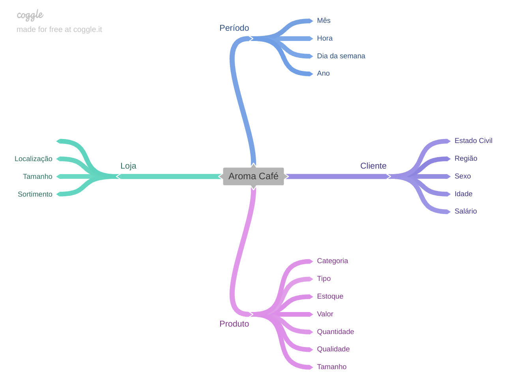

# Data-Analysis-in-Production
A cafeteria Aroma Café foi criada há 10 anos e ao longo destes anos ofertou seus produtos para vários clientes no centro da cidade, estando hoje com 3 lojas. Ao longo destes anos a concorrência foi surgindo nos arredores das lojas e gerando uma sensação de perda de clientes e de flutuações no faturamento. Comprovada em análise interna feita pelo CEO, Sr. Oliveira. 
Contudo, o Sr. Oliveira achou pertinente comprovar ou refutar esta sensação por meio de análise profissional e, portanto, resolvi desenvolver as análises a fim de responder exatamente as questões que mais o incomodavam. Após entender os questionamentos do CEO, realizei a análise dos dados fornecidos em arquivo de planilha google. Antes mesmo de iniciar as análises definimos os objetivos, as premissas assumidas, mindmap de hipóteses, prototipagem e etapas do desenvolvimento. 

Para acessar o dashboard e dados, acesse: https://docs.google.com/spreadsheets/d/1hfcrbar1zQAcH7FEy0Q_6IEh_bMkVKlp8-ZVBNg1JS4/edit?usp=drive_link

# Objetivos

Responder às perguntas de negócio da Cafeteria Aroma Café:

1. Como está a saúde da rede de cafeterias, no geral? Elas estão indo bem ou mal? 
2. Existe algum motivo do porque a rede está indo bem ou mal? Você poderia me explicar o que está causando uma boa ou má saúde do negócio? 
3. Você poderia prever o faturamento da rede de cafeteria nos próximos 30 dias? ( Mês de Julho de 2023 ) 
4. Quais são as suas recomendações para alavancar ainda mais o negócio, caso ele esteja indo bem ou reverter uma situação ruim, caso ele esteja indo mal? 

# MindMape de Hipóteses

O MIndMape de Hipóteses foi crucial para entendermos quais elementos estavam envolvidos neste negócio em específico permitindo criar suposições voltadas ao entendimento do cenário apresentado no momento, bem como poderíamos obter as tendências para o próximo mês. Além de poder analisar os limites da análise em decorrência da base de dados acessível.

# Estrutura do Projeto

### Descrição dos dados

Em projetos de análise de dados são necessárias algumas etapas: conhecimento do negócio, entender o problema de negócio, limpeza e transformação dos dados, análise exploratória, criação de variáveis, aplicação de algoritmos de previsão, extração de insights.

Após das análises é importante conhecer um pouco mais sobre os dados entregues para análise, um arquivo de planilha google contendo 149.117 linhas e 18 colunas. Este dataset possui uma granularidade de 1 para n, ou seja, 1 transação pode conter mais de 1 produto. Segue descrição das colunas.

| Coluna | Descrição |
|:------ |:-------|
|transaction_id |Id único da transação |
|transaction_date | Data da transação|
|transaction_time |Horário da transação|
|store_id |Id único da loja|
|store_location |Localização|
|product_id |Id do produto|
|transaction_qty | Quantidade de produtos|
|unit_price | Preço unitário|
|Total_Bill| Total da venda|
|product_category | Categoria do produto|
|product_type | Tipo do produto|
|product_detail|Detalhe do produto|
|Size |  Tamanho|
|Month Name | Nome do mês|
|Day Name |Nome do dia |
|Hour | Hora | 
|Month | Mês |
|Day of Week | Dia da semana|

Neste caso em específico não houve a necessidade de limpeza ou transformação dos dados. Na análise exploratória dos dados foi possível delimitar as hipóteses com base nas variáveis disponíveis, ou seja, limitando-nos às vendas, por produto, por loja, por categoria, por mês, por hora, por tamanho e demais possibilidades. Portanto, com base na descrição já podemos adiantar que não é possível analisar o impacto de lojas adjacentes sobre o faturamento, pois não temos qualquer dados que remeta a concorrência.

### Estrutura por análise
#### 1. Análise Descritiva
- Objetivo: Compreender o panorama atual dos dados e obter uma visão geral dos principais indicadores.
- Método: Exploração inicial e resumo estatístico dos dados. 
- Principais Métricas Analisadas:
Distribuições de Variáveis: Análise de distribuição de dados relevantes, como faturamento total da base de dados fornecida, número de categorias de produtos, quantidade de tipo de produtos e tendência para o período de tempo. Aqui, demonstrei com um gráfico de linha o faturamento ao longo do tempo e cards com números importantes da cafeteria. Ainda com gráfico de linha analisei o faturamento ao longo do tempo por loja. Por meio de um gráfico de colunas apresentei o faturamento total por unidade de loja. Além deste, outro gráfico de barras empilhadas foi utilizado para demonstrar o faturamento por dia da semana. Explorei ainda o faturamento mensal por categoria de produto, também, com empilhamento de barras. Por fim, utilizei um gráfico combinado, de linha e colunas, para expor o percentual de faturamento por grupo de horas. Por fim, fiz uso de um gráfico de de colunas, onde fpi possível observar ao longo dos meses o desempenho percentual das categorias vendidas.
- Tendências Temporais: Comportamento dos principais KPIs ao longo do tempo.
- Segmentação: Análise por categorias, localidade, tempo, dias da semana e meses.
- Resultados: Identificação dos períodos de alta e baixa, itens com maior e menor popularidade.
####2. Análise Diagnóstica
- Objetivo: Investigar as causas dos padrões identificados na análise descritiva.
- Método: Aplicação de análises correlacionais e testes de hipóteses para validar relações entre variáveis.
- Abordagens Utilizadas:
- Correlação: Identificação de variáveis que influenciam diretamente os resultados.
- Segmentação Detalhada: Exploração das diferenças de comportamento por tamanho de produto, por loja, por preço médio unitário e total e por mês.
- Resultados: Descoberta dos principais fatores que impulsionam ou reduzem o desempenho, ajudando a entender o que leva a flutuações nos indicadores.
#### 3. Análise Preditiva
- Objetivo: Prever o comportamento futuro com base nos dados históricos.
- Método: Aplicação de modelos de previsão de regressão XLMiner Analysis ToolPak
- Modelos e Técnicas:
 - Modelagem de Séries Temporais: Aplicação de algoritmos de regressão para prever tendências futuras. Antes de aplicar o algoritmo, relizamos uma média móvel com janelas de 20 até 60 dias para definir os ciclos. Foi analizado a tendência e sazonalidade nos diferentes ciclos adotados.
 - Teste e Validação: Avaliação da acurácia dos modelos através de métricas de erro MAPE e RMSE.
- Resultados: Projeção de KPIs futuros, faturamento, para o próximo mês, proporcionando insights sobre tendências que podem auxiliar no planejamento estratégico.
#### 4. Análise Prescritiva
- Objetivo: Gerar recomendações práticas para maximizar resultados futuros ou mitigar problemas.
- Método: Simulação de cenários e análise de impacto de diferentes estratégias.
- Abordagens:
 - Cenários Alternativos: Criação de múltiplos cenários com base nos ajustes de média móvel para avaliar impactos potenciais de diferentes estratégias.
   Análise de Sensibilidade: Identificação de variáveis com maior impacto nos resultados futuros.
   Recomendações Baseadas em Dados: Recomendações práticas derivadas das descobertas anteriores.
- Resultados: Planos de ação sugeridos para aproveitar oportunidades de crescimento ou para conter possíveis quedas.
- Ferramentas Utilizadas
- Modelagem e Previsão:
   Modelos estatísticos de média móvel, tendência, sazonalidade e regressão.
- Visualização:
  Gráficos interativos para facilitar a compreensão e comunicação dos insights no Google Sheets.

# Resultados

### Análise descritiva
#### Relatório

1. Com base no faturamento há uma tendência de crescimento mensal chegando ao final do semestre com um aumento total de quase 20%.
2. O faturamento sofre uma queda de 7% em fevereiro. Volta a subir em 29% em março e mantém uma média de crescimento até o final do semestre de 22%.
3. O faturamento por loja é muito semelhante.
4. O faturamento por loja segue a mesma tendência do faturamento geral. Ambas as lojas sofrem queda de vendas em fevereiro e depois retoma o aumento mensalmente.
5. As primeiras e as intermediárias, são responsáveis por quase 80% do faturamento.
6. Sábados e Domingos apresentam crescimento mês a mês. Segundas e terças apresentam queda em fevereiro, seguido de aumento nos meses seguintes e queda no último mês. A quarta apresenta aumento até maio, apresentando queda em junho. A quinta e a sexta, apresentam aumento até março e queda em abril, seguido de aumento nos meses seguintes.
7. As categorias de produtos responsáveis por 80% do faturamento mensal são o Tea e o Coffe
8. As categorias coffe, tea, breakin e drinkins apresentam comportamento mensal semelhante ao longos dos meses. Já as demais categorias oscilam muito no mês a mês.
9. A rede de cafeterias estão indo bem apesar de oscilações de faturamento mensal, assim como as oscilações em diferentes dias da da semana.

### Análise Diagnóstica
#### Relatório

1. O faturamento apresenta forte correlação com os vários tamanhos dos produtos. Portanto, o tamanho dos produtos não impacta negativamente no faturamento.
2. A localização das lojas também apresenta importante correlação com o faturamento e portanto não temos unidades que sejam impactadas negativamente pela localidade.
3. Com relação ao preço médio unitário não houve correlação forte, mas ela é inversamente proporcional em alguns meses. Ou seja, enquanto o preço médio unitário reduziu em alguns meses, o faturamento aumentou. Isto pode indicar que a loja acabou vendendo mais produtos baratos e em maior volume. Porém as quedas e aumentos não se dão na mesma proporção do crescimento e queda no mês coincidente em relação ao faturamento.
4. O mesmo comportamento da análise anterior segue para a análise de preço médio total.
5. Já era de se esperar também que o aumento de produtos aumentasse o faturamento dada a forte correlação existente.

### Análise Preditiva
#### Relatório

1. Considerando uma janela de 30 dias encontramos uma previsão diária de R$457,00.
2. Considerando a margem de erro de 8,6% a previsão pode ser de 8% para mais ou para menos;
3. O faturamento total previsto para os próximos 30 dias é de R$185.495,01. Um pouco abaixo faturamento para os mesmo 30 dias considerando-se apenas a tendência, mas ainda dentro da margem de erro de 8%;
4. Estes 8% refere-se a uma janela de média móvel de 30 dias que foi escolhida devido a diferença mínima percentual, comparada a janela de 60 dias. 
5. Levando-se em consideração a série temporal de apenas 6 meses, quanto menor o erro e menor a janela de média móvel de tempo, melhor.
 
### Análise Prescritiva
#### Relatório

1. Incentivar o aumento de produtos únicos: Considerando o nosso p-valor de 5%, no cenário 3, podemos afirmar que a cada produto único vendido aumentamos o faturamento em quase R$2.700,00. A recomendação é de que há uma possibilidade de aumento do faturamento ao aumentar a quantidade de produtos únicos vendidos
2. Reduzir categorias: Ainda com base no cenário 3, para a categoria única, temos que a cada venda de um produto de uma categoria única há uma redução do faturamento em quase R$1.850,00. Ou seja, podemos recomendar, que há uma possibilidade de reduzir o número de categorias para aumentar o faturamento e focar nas categorias que mais vendem.
3. Manter preços médios: Outro ponto de observação são os preços médios, pois eles reagem negativamente ao faturamento. Sendo assim, a cada unidade de preço médio aumentado eu tenho uma redução no faturamento em torno de quase R$742,00.
4. Reduzir tipo único de produtos: Apesar do p-valor estar alto, existe uma considerável correlação entre produtos únicos e faturamento. Portanto, seria interessante testar que ao reduzir os tipos únicos eu teria uma aumento em torno de R$2.367,00 no faturamento.
5. Os cenários 1 e 2 foram descartados, devido aos valores de p-valor que não traziam confiança considerando as variáveis analisadas pela regressão linear. 

# Conclusões

Diante das análises realizadas com base nos últimos 6 meses de faturamento da cafeteria Aroma Café, podemos afirmar que não há qualquer indício de queda no faturamento. Primiero porque a análise descritiva aponta uma queda no mês de fevereiro, apenas. No entanto, ao longo dos demais meses houve uma aumento do faturamento mês a mês com tendência sempre de crescimento.

De acordo com a análise diagnóstica podemos encontrar que talvez o faturamento tenha tido uma queda em fevereiro pelo fato de ter sido vendido mais produtos com valor médio total e unitário mais altos, pois apesar da baixa correlação entre faturamento e preço, estas são inversamente proporcionais. Esta análise ainda apontou que o faturamento aumentou quando a quantidade de produtos aumentou.

Com a análise preditiva é possível as variações de faturamento para o mês e também diária. Isso permite controlar melhor o financeiro do Aroma Café, desde os gastos corriqueiros aos investimentos previstos.

Com a análise prescritiva entendemos que várias categorias podem reduzir o faturamento, assim como vendas de produtos únicos aumentam o faturamento. Além de ser possível recomendar a manutenção dos preços médios, pois ele interfere negativamente no faturamento.

# Próximos Passos

- Automação do relatório para o CEO ter acesso rápido a estas análises.
- Aplicar novas medidas estatísticas e de machine learning.
- Avaliar uma base maior de dados.

